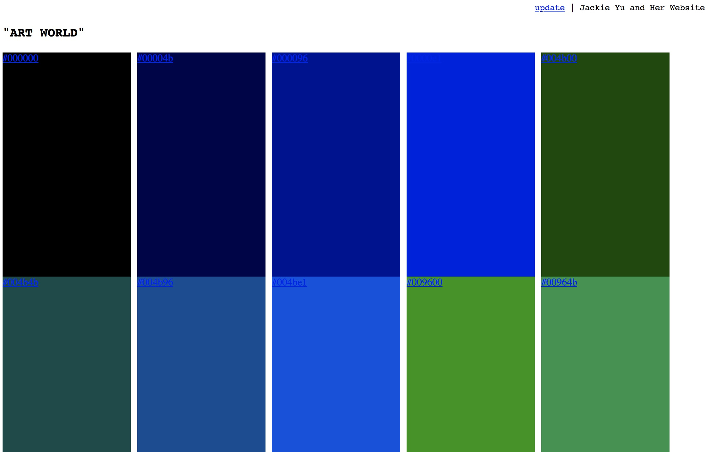
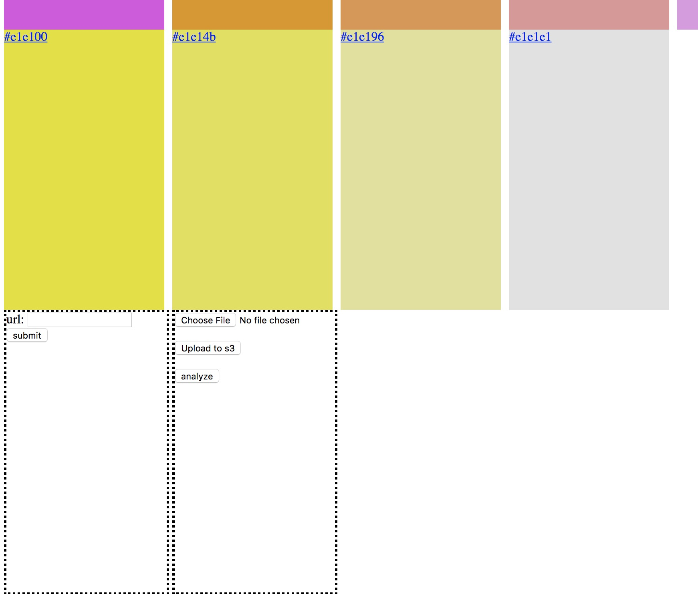
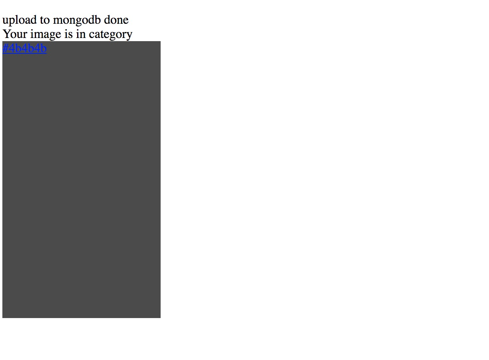
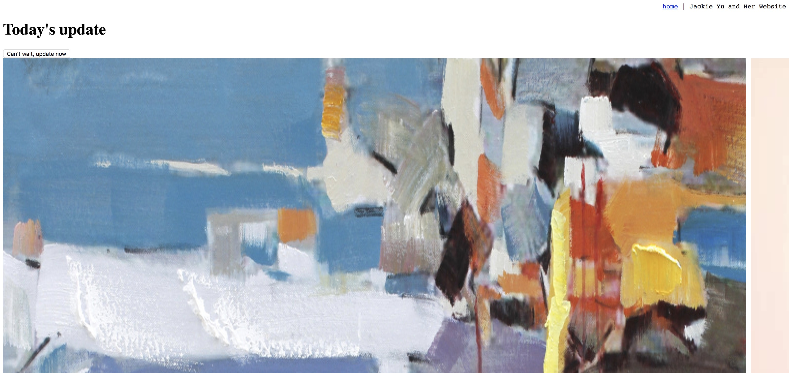

ArtWorld 

This application is no longer hosted on EC2, local run only

ArtWorld is a online gallery project that arose from Jackie's passion for Art. It features AI image recoginition to classify artwork by colors, user upload and daily auto upload from images fetched online. 

main page

upload section

upload success

update section

thanks to:
Clarifai api
watchmecode on s3httppost

